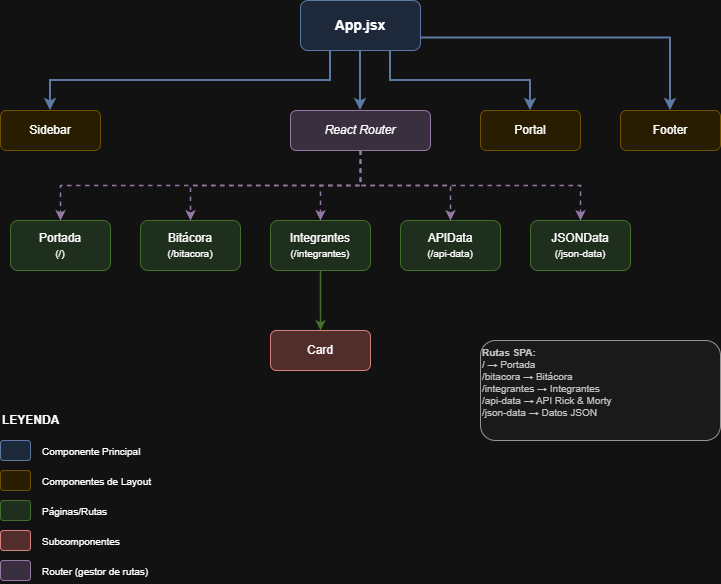

# Proyecto: Portalverse (TP) — Grupo 6

Descripción
-----------
Proyecto SPA desarrollado con React + Vite. Presenta una portada del equipo, páginas individuales por integrante, una bitácora, una sección que consume la API pública de Rick and Morty (personajes) y una sección que muestra datos locales desde un archivo JSON.

Características principales
-------------------------
- SPA con rutas (React Router).
- Sidebar lateral fijo con navegación.
- Portal visual (imagen + anillos animados) que aparece al cambiar de sección.
- Efecto de sonido al abrir el portal (archivo en `public/assets/portal-sound.mp3` o fallback sintetizado).
- Consumo de API Rick and Morty (buscador por nombre) y traducción de campos relevantes al español.
- Datos locales renderizados desde `src/data/data.json`.

Arbol de Renderizado
-----------------------




Estructura del proyecto
-----------------------
```
/ (root)
├─ public/
│  ├─ assets/
│  │  ├─ pic_1.jpg
│  │  ├─ pic_2.png
│  │  ├─ pic_3.jpg
│  │  ├─ pic_4.jpg
│  │  ├─ rickAndMortyPortal.png   # imagen del portal
│  │  └─ portal-sound.mp3        # sonido del portal (opcional)
│  └─ index.html
├─ src/
│  ├─ main.jsx
│  ├─ App.jsx
│  ├─ styles/
│  │  ├─ App.css
│  │  └─ index.css
│  ├─ components/
│  │  ├─ Sidebar.jsx
│  │  ├─ Sidebar.css
│  │  ├─ Footer.jsx
│  │  ├─ Footer.css
│  │  ├─ Portal.jsx
│  │  └─ Card.jsx
│  ├─ pages/
│  │  ├─ portada/Portada.jsx
│  │  ├─ portada/Portada.css
│  │  ├─ integrantes/Integrantes.jsx
│  │  ├─ integrantes/Integrantes.css
│  │  ├─ Bitacora.jsx
│  │  ├─ Bitacora.css
│  │  ├─ APIData.jsx
│  │  ├─ APIData.css
│  │  ├─ JSONData.jsx
│  │  └─ JSONData.css
│  ├─ hooks/
│  │  └─ useFetch.js
│  ├─ services/
│  │  └─ rickAndMorty.js
│  ├─ utils/
│  │  └─ translate.js
│  └─ data/
│     └─ data.json
├─ package.json
└─ vite.config.js
```

Cómo ejecutar (desarrollo)
-------------------------
Desde la raíz del proyecto:

```bash
npm install
npm run dev
```

Abre el navegador en la URL que indique Vite (por defecto `http://localhost:5173`).

Build de producción
-------------------
```bash
npm run build
npm run preview
```

Rutas disponibles
-----------------
- `/` → Portada (index.html en la raíz)
- `/bitacora` → Bitácora del proyecto
- `/integrantes` → Páginas de integrantes (vínculos desde la portada)
- `/api-data` → Sección que consume la API de Rick and Morty (buscador por nombre)
- `/json-data` → Datos leídos desde `src/data/data.json`
